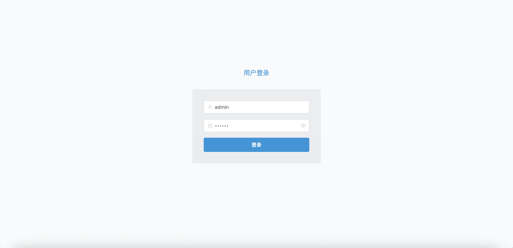

⚡️使用Vue3 & ElementUI & TypeScript构建的后台管理快速开发模版 
内置i18n国际化、store、TailwindCSS、axios框架。

## Usage

1. Clone this repository
2. yarn install
3. yarn run dev

# Screenshot

  
  

# Author

CoolSnow

Email: coolsnow2020@gmail.com

Twitter: https://twitter.com/CoolSnow0927
